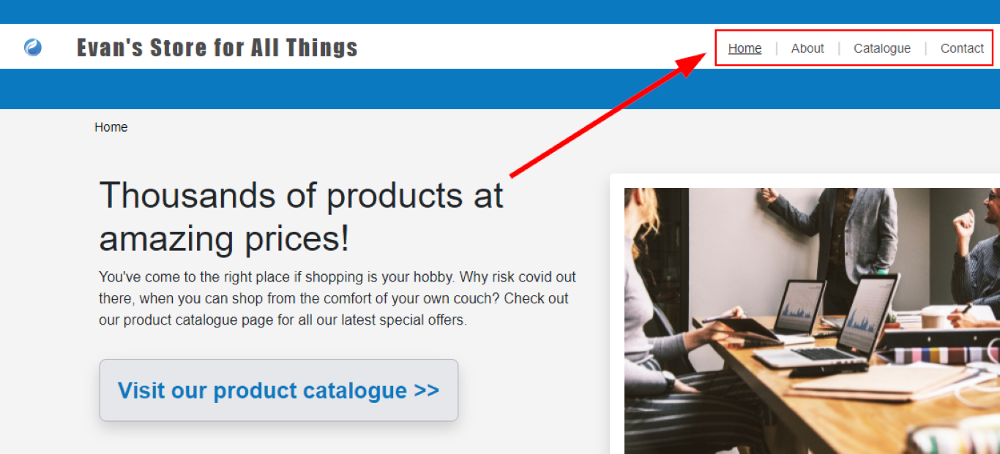

# HyperionDev Full Stack Web Development Bootcamp - Level 1 - Task 7 - Capstone project 1 - Basic Online Store

## Description
This project was to create a basic online store to display a few fictitious products.

## Table of Contents
* [Instructions](#instructions)
* [Technologies](#technologies)
* [Installation](#installation)
* [Usage and Rules of Game](#usage)
* [Credits](#credits) 

## Instructions
These were the instructions I was given to guide me in creating this game.

**Compulsory Task 1**
Note: Feel free to reuse any work you have already done for this project. Your online store is required to implement the following:
* Create a homepage which acts as the landing page for your store.
* Create at least 2 other pages (this could include pages such as “about us”, “meet the team”, “shipping details”, etc).
* Additionally, your site must have a catalogue page which lists the items which are for sale.
* Your catalogue page should have at least 5 items for sale (include some details of the item).
* Clicking on an item should allow the user to see more details about the item, such as a brief description,.specifications and price
* Within the entirety of your site, you should have the following elements:
    * At least 5 images.
    * At least 3 font sizes (to help differentiate sections).
    * At least 2 external links (maybe to a shipping company, or an email address).
    * At least 1 table.
    * At least 1 list (ordered or unordered, you can choose).
    * At least one submit button form (possibly to simulate a login - don’t worry about the functionality of this yet).
    * At least one radio button form (you could select different kinds of shipping methods to your location).
    * At least one quote/testimonial (this could be from a previous customer or a review).
    * At least 2 blocks (i.e text with a background).
* Note: Feel free to reuse any HTML that you have created earlier in this Bootcamp.

**Compulsory Task 2**
Your online store is required to implement the following:
* Within the entirety of your site, you should have the following styling:
    * At least 3 font styles with different colouring effects.
    * Padding for all images and buttons.
    * Borders for all images and tables.
    * At least 2 floating boxes.
    * Background colours/images for all pages.
    * All tables must have customised formatting (colours, layout, etc).
    * Center all content, with the exception of multiple row items being equally padded around the centre.
    * All lists must be customised.
    * Animate background colours to change between different variants of colours (a bit of Googling here will help you).
    * Animate item images to expand when hovered over (or clicked on if you prefer).
    * Apply a colour filter to at least 2 images.
* Note: Feel free to use Bootstrap but ensure that you also create your own CSS rules. Ensure that you at least have your own external stylesheet that implements some of the criteria listed above.

### Technologies
This project uses:
* HTML 5 
* CSS 3

## Installation
This project was created using HTML and CSS and requires no installation. Simply navigate to the [website](https://evanmalherbe.github.io/capstoneProject1/) in your browser and explore.

## Usage 
Click on the menu options on the top right hand side of the page to navigate to the various pages on the website. See figure 1 below.

## Credits
This project was created by Evan Malherbe as part of a task for HyperioDev Full Stack Development Bootcamp November 2021 [GitHub profile](https://github.com/evanmalherbe) 